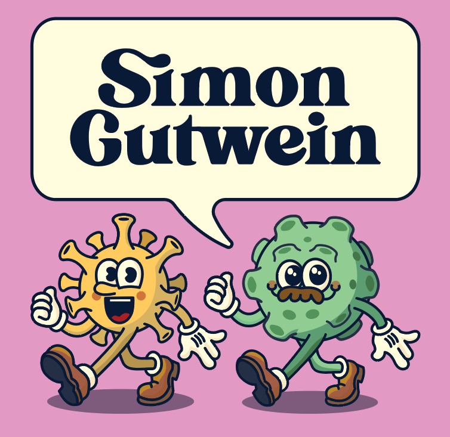
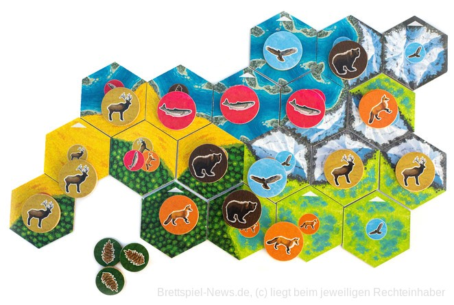

---
############################################################
#         Want to add an image for the person?
#  Add image with name 'avatar.jpg' (or .png) to folder
############################################################

# Display name
title: Simon Gutwein

# Full Name (for SEO)
first_name: Simon
last_name: Gutwein

# Username (this should match the folder name) -> used to mark user as the author of a post
authors:
  - simon-gutwein

# Is this the primary user of the site? (default false)
superuser: false

# Role/position -> listed below the name (in peoples tab or under articles/events)
role: PhD Student

# Organizations/Affiliations
#organizations:
#  - name: Stanford University
#    url: ''

# Short bio (displayed in user profile at end of posts)
bio: #Insert a short bio that is displayed in the user profile at the end of a post.

interests:

education:
  #courses:
  #  - course: Example course
  #    institution: University
  #    year: year

# Social/Academic Networking
# For available icons, see: https://docs.hugoblox.com/getting-started/page-builder/#icons
#   For an email link, use "fas" icon pack, "envelope" icon, and a link in the
#   form "mailto:your-email@example.com" or "#contact" for contact widget.
social:
  - icon: envelope
    icon_pack: fas
    link: 'mailto:simon.gutwein@ccri.at'
#  - icon: google-scholar
#    icon_pack: ai
#    link: https://scholar.google.co.uk/citations?user=sIwtMXoAAAAJ
#  - icon: github
#    icon_pack: fab
#    link: https://github.com/gcushen
# Link to a PDF of your resume/CV from the About widget.
# To enable, copy your resume/CV to `static/files/cv.pdf` and uncomment the lines below.
# - icon: cv
#   icon_pack: ai
#   link: files/cv.pdf

# Enter email to display Gravatar (if Gravatar enabled in Config)
email: ''

# Highlight the author in author lists? (true/false)
highlight_name: false

# Organizational groups that you belong to (for People widget)
#   Set this to `[]` or comment out if you are not using People widget.
user_groups:
  - Members
---

## Get to know me

**What’s your secret side project?**

Through a colleague at work, I developed an interest in Adobe Illustrator and the art of creating scientific graphics. I gradually got more and more into it – starting with simple sketches and eventually working my way up to fully-fledged graphical abstracts. Along the way, I taught myself about design principles and color theory, which I now apply to make my figures not just informative but also visually engaging.

I’ve helped several friends design illustrations for their papers – and I truly enjoy it!
(You can check out my two hand-drawn lab mascots below.)

**What’s the nerdiest thing you’ve ever done?**

I’m a huge fan of board games – especially Cascadia, a game where you arrange animal and landscape tokens according to specific rules to earn points. At one point, I got really into it. The scoring process, however, can be a bit tedious: for example, you get points for the longest continuous line of fish, or for each fish adjacent to a bear – but only if there’s no eagle next to it.

Since I was working with segmentation algorithms around that time, I thought: “Why not build an algorithm that analyzes a photo of the board and automatically calculates the score?”
Sounds simple... but it wasn’t.

I had to:
- segment and classify each tile,
- recognize the landscape type underneath each token,
- reconstruct the hexagonal coordinate system,
- and correct for camera perspective distortions.

I got as far as implementing all the scoring rules correctly – and learned a lot in the process, especially about image segmentation, perspective correction, and how geometry and semantics interact.
10/10 – would absolutely do it again!

**Which sci-fi movie setting would you love to become reality and why?**

One of my favorite shows is Rick and Morty – and if I had the chance, I’d love to go on an interdimensional adventure with them.
I find the concept of the multiverse and traveling between realities not only scientifically intriguing but also hilariously absurd. The characters are brilliantly exaggerated, the storylines are pure chaos, and the humor is exactly my kind of ridiculous.

In the best case, I’d end up in an alternate reality where I co-develop an over-the-top AI with Rick – or maybe I’d get miniaturized and explore the cell microenvironment from up close.
I’m open to anything!
